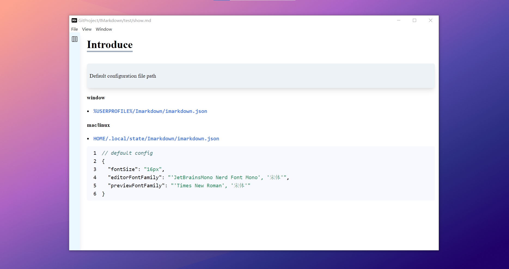

imarkdown 是一款正在开发中的轻量级 markdown 编辑器，使用的技术栈为：Electron，ReactJS，ChakraUI，Codemirror。[项目地址](https://github.com/ccg1024/IMarkdown)

目前进度：

1. 实现基本编辑功能，

2. 内嵌 prettier 对文件进行格式化

3. 编辑视图与预览视图内容同步定位

# 2023/04/23

**Feature**

- Vim support

- Telescope-like recent file browsing in vim mode

- Auto format

